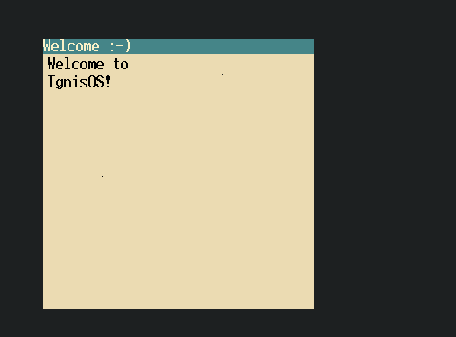

# IgnisOS

## Revamped version
https://github.com/Qnixx/src

## Docs.

See share/docs/building.md for build instructions
See share/docs/log.md for info about the log file.

## Pre-built images
Go to [the most recent job](https://github.com/Ian-Marco-Moffett/IgnisOS/actions) and Ignis.iso will be located under Artifacts.

# Screenshot

